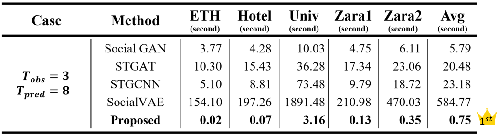

# SA-SocialGau (A Self-adapted Social Interaction with 2D Gaussian-based Algorithm for Pedestrian Trajectory Prediction)

[中文版本](./README_zh-TW.md)

This repository is **for technical demonstration only**. It does **not** contain the original research source code, nor the complete implementation.  
It provides a simplified showcase of pedestrian trajectory prediction research, intended for explaining concepts and supporting autonomous driving–related studies.  
The demo illustrates trajectory prediction using a **2D Gaussian model** combined with a **socially adaptive interaction algorithm**, and evaluates predictions with **ADE (Average Displacement Error)** and **FDE (Final Displacement Error)**.  
The project includes data I/O, a basic predictor, and unit tests, making it easy to extend and experiment with.  

---

## Features

- Achieves accuracy comparable to many papers using 8 observed steps while only using 3 observed steps.  
- Real-time computing capability.  
- Adaptive to various scene changes.  
- Lower complexity compared to deep-learning–based approaches.  
- No pre-training required.  
- Built-in unit testing (CTest).  

---

## Illustrations
- The following figures are **conceptual illustrations only**, not based on actual research parameters or data.  
<a href="images/demo1.gif">
    
</a>  
<a href="images/demo2.gif">
    
</a>

---

## Experimental Results
- **Runtime Performance:**  
<a href="images/runtime.png">
    
</a>  

- **Accuracy Evaluation:**  
<a href="images/result.png">
    
</a>  

*References:
[Social GAN](https://openaccess.thecvf.com/content_cvpr_2018/html/Gupta_Social_GAN_Socially_CVPR_2018_paper.html), 
[STGAT](https://openaccess.thecvf.com/content_ICCV_2019/html/Huang_STGAT_Modeling_Spatial-Temporal_Interactions_for_Human_Trajectory_Prediction_ICCV_2019_paper.html), 
[STGCNN](https://openaccess.thecvf.com/content_CVPR_2020/html/Mohamed_Social-STGCNN_A_Social_Spatio-Temporal_Graph_Convolutional_Neural_Network_for_Human_CVPR_2020_paper.html), 
[SocialVAE](https://link.springer.com/chapter/10.1007/978-3-031-19772-7_30)*  

---

## Development Environment

- CMake ≥ 3.16  
- C++17 compiler (GCC/Clang/MSVC)  
- `jsoncpp` (detected via pkg-config)  
  - Linux: `sudo apt-get install libjsoncpp-dev`  
  - Windows: via [vcpkg](https://vcpkg.io/en/) or [Chocolatey](https://chocolatey.org/)  
  - macOS: `brew install jsoncpp`  

---

## Usage Example

1. **Update system packages**
    ```bash
    sudo apt update
    sudo apt upgrade -y
    ```

2. **Install dependencies**
    ```bash
    sudo apt install -y g++ cmake pkg-config libjsoncpp-dev
    ```

3. **Build the project**
    ```bash
    cd ~/SA-SocialGau
    rm -rf build
    mkdir build && cd build
    cmake .. -DCMAKE_BUILD_TYPE=Release
    cmake --build .
    ```
    After compilation, the executable `build/SA-SocialGau` will be generated.

4. **Run demo**
    ```bash
    ./build/SA-SocialGau <JSON_PATH>
    ```
    If `<JSON_PATH>` is not provided, the program will default to `datasets/eth.json`.

5. **Run tests**
    ```bash
    cd build
    ctest

    # Or run directly
    ./test_metrics
    ```
    > The test is a **smoke test**, mainly ensuring the program does not crash under empty input and can return results properly.  

---

## Project Structure
```
SA-SocialGau/
├── README.md
├── README_zh-TW.md
├── images/
│   ├── demo1.gif
│   ├── demo2.gif
│   ├── result.png
│   └── runtime.png
├── include/
│   ├── args.hpp
│   ├── types.hpp
│   ├── io.hpp
│   ├── predictor.hpp
│   ├── metrics.hpp
│   ├── field_iface.hpp
│   └── sd_utils.hpp
├── src/
│   ├── main.cpp
│   ├── args.cpp
│   ├── io.cpp
│   ├── predictor.cpp
│   ├── metrics.cpp
│   └── sd_utils.cpp
├── tests/
│   └── test_metrics.cpp
├── datasets/
│   ├── eth.json
│   ├── hotel.json
│   ├── univ.json
│   ├── zara1.json
│   └── zara2.json
├── CMakeLists.txt
├── .gitattributes
├── .gitignore
└── LICENSE
```

---

## License & Acknowledgments

- This project is licensed under the **MIT License** (see [LICENSE](./LICENSE)).  
- Some algorithmic concepts and mathematical formulas are derived from the author’s master’s thesis research.  
- Thanks to [jsoncpp](https://github.com/open-source-parsers/jsoncpp) for JSON parsing support.  
