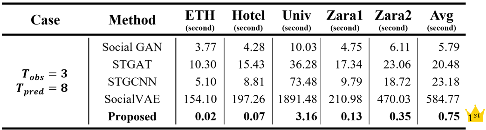
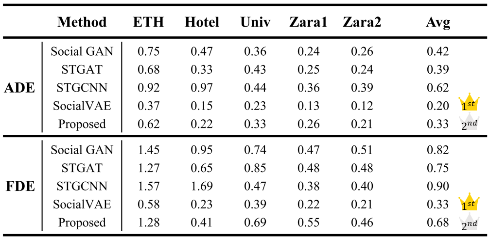

# 自適應社交影響之二維高斯行人軌跡預測 (SA-SocialGau)

[English Version](./README.md)

本專案僅為技術展示用，**非原始碼**，並不包含原始研究完整實作，為行人軌跡預測研究成果的簡易展示，用於輔助自動駕駛相關研究與說明。  
專案示範以 **二維高斯模型** 搭配 **社交互動自適應演算法** 進行軌跡預測，並計算 **ADE (Average Displacement Error)** 與 **FDE (Final Displacement Error)**。  
程式包含資料讀取、基礎 Predictor 與單元測試，方便後續研究與擴充。 

---

## 功能特色

- 僅使用 3 步歷史軌跡，即達到大部分論文使用 8 步歷史軌跡的準確度。
- 運算效能達到能即時運算（Real-time computing）的結果。
- 能夠自適應各種場景的變化。
- 相較使用深度學習之相關文獻有著更低的複雜度。
- 不需要預先訓練模型。
- 內建單元測試（CTest）

---

## 示意圖
- 下圖為示意圖，僅用於解釋概念，與實際研究參數與資料無關。  
<a href="images/demo1.gif">
    
</a>  
<a href="images/demo2.gif">
    
</a>

---

## 實驗結果
- **效能評估：**  
<a href="images/runtime.png">
    
</a>  

- **準確度評估：**   
<a href="images/result.png">
    
</a>  

**參考文獻：**  
[Social GAN](https://openaccess.thecvf.com/content_cvpr_2018/html/Gupta_Social_GAN_Socially_CVPR_2018_paper.html)  
[STGAT](https://openaccess.thecvf.com/content_ICCV_2019/html/Huang_STGAT_Modeling_Spatial-Temporal_Interactions_for_Human_Trajectory_Prediction_ICCV_2019_paper.html)  
[STGCNN](https://openaccess.thecvf.com/content_CVPR_2020/html/Mohamed_Social-STGCNN_A_Social_Spatio-Temporal_Graph_Convolutional_Neural_Network_for_Human_CVPR_2020_paper.html)  
[SocialVAE](https://link.springer.com/chapter/10.1007/978-3-031-19772-7_30)  

---

## 開發環境

- CMake ≥ 3.16
- C++17 編譯器（GCC/Clang/MSVC）
- `jsoncpp`（透過 pkg-config 偵測）
  - Linux: `sudo apt-get install libjsoncpp-dev`
  - Windows: 可用 [vcpkg](https://vcpkg.io/en/) 或 [Chocolatey](https://chocolatey.org/)
  - macOS: `brew install jsoncpp`

---

## 使用範例

1. **更新系統套件**
    ```bash
    sudo apt update
    sudo apt upgrade -y
    ```

2. **安裝前置依賴項**
    ```bash
    sudo apt install -y g++ cmake pkg-config libjsoncpp-dev
    ```

3. **建置與編譯專案**
    ```bash
    cd ~/SA-SocialGau
    rm -rf build
    mkdir build && cd build
    cmake .. -DCMAKE_BUILD_TYPE=Release
    cmake --build .
    ```
    編譯完成後，會產生執行檔 `build/SA-SocialGau`

4. **執行範例**
    ```bash
    ./build/SA-SocialGau <JSON_PATH>
    ```
    若未指定 `<JSON_PATH>`，程式預設會載入 `datasets/eth.json`

5. **執行測試**
    ```bash
    cd build
    ctest

    # 或者直接執行
    ./test_metrics
    ```
    > 測試為 **smoke test**，主要檢查程式在空輸入下不會崩潰並能正常回傳結果。

---

## 專案結構
```
SA-SocialGau/
├── README.md
├── README_zh-TW.md
├── images/
│   ├── demo1.gif
│   ├── demo2.gif
│   ├── result.png
│   └── runtime.png
├── include/
│   ├── args.hpp
│   ├── types.hpp
│   ├── io.hpp
│   ├── predictor.hpp
│   ├── metrics.hpp
│   ├── field_iface.hpp
│   └── sd_utils.hpp
├── src/
│   ├── main.cpp
│   ├── args.cpp
│   ├── io.cpp
│   ├── predictor.cpp
│   ├── metrics.cpp
│   └── sd_utils.cpp
├── tests/
│   └── test_metrics.cpp
├── datasets/
│   ├── eth.json
│   ├── hotel.json
│   ├── univ.json
│   ├── zara1.json
│   └── zara2.json
├── CMakeLists.txt
├── .gitattributes
├── .gitignore
└── LICENSE
```

---

## 版權與致謝

- 本專案採用 **MIT License**（詳見 [LICENSE](./LICENSE)）。  
- 部分演算法與數學公式來自作者個人碩士論文研究。  
- 感謝 [jsoncpp](https://github.com/open-source-parsers/jsoncpp) 提供 JSON 處理支援。  